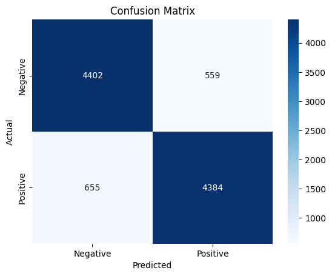
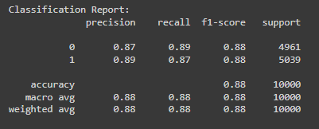
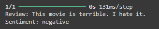
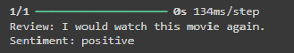

## SentimentLens: Decoding Emotions in IMDB Movie Reviews with Deep Learning
A sentiment analysis model using Bidirectional LSTM, Attention Mechanism and pre-trained GloVe embeddings, implemented with Keras.

This project implements a Sentiment Analysis model using a Bidirectional Long Short-Term Memory (LSTM) network with an Attention Mechanism. The model is trained on the IMDB movie reviews dataset and utilizes pre-trained GloVe embeddings to enhance word understanding.

## Table of Contents
- [Project Overview](#project-overview)
- [Model Architecture](#model-architecture)
- [Dataset](#dataset)
- [Installation](#installation)
- [How to Run](#how-to-run)
- [Results](#results)
- [Future Work](#future-work)

  ---  

## Project Overview
This project applies deep learning techniques to classify movie reviews based on their sentiment—positive or negative. The model is trained using the IMDB Movie Reviews dataset, which contains 50,000 labeled reviews. Key components include:
- **Bidirectional LSTM** for learning sequential information from both directions of the text.
- **Attention Mechanism** to focus on important parts of the review.
- **Pre-trained GloVe Embeddings** for rich semantic representation of words.

---

## Model Architecture
The model consists of:
- **Embedding Layer**: Uses GloVe embeddings for word representations.
- **Bidirectional LSTM**: Captures long-term dependencies from both directions in the text.
- **Attention Layer**: Focuses on key parts of the input sequence to enhance performance.
- **Dense Layers**: Fully connected layers to process the output of the LSTM and Attention layers.
- **Output Layer**: Uses sigmoid activation for binary classification (positive or negative sentiment).

---

## Dataset

We use the [IMDB Movie Reviews Dataset](https://www.kaggle.com/datasets/lakshmi25npathi/imdb-dataset-of-50k-movie-reviews), which consists of 50,000 movie reviews labeled as either positive or negative. The dataset is balanced with 25,000 positive and 25,000 negative reviews.

---

## Installation

To run this project locally, follow the steps below:

1. **Clone the Repository**:
   ```bash
   git clone https://github.com/rahul-vinay/SentimentLens.git
   cd SentimentLens
   
2. **Install the dependencies**
   ```bash
   pip install -r requirements.txt

3. **Download GloVe Embeddings**:
   ```bash
   wget http://nlp.stanford.edu/data/glove.6B.zip
   
   unzip glove.6B.zip

## How to Run
1. **Run the Notebook**:   
- You can open the .ipynb file (e.g., SentimentLens.ipynb) in Jupyter Notebook or Google Colab.
- Follow the cells in the notebook to preprocess the data, train the model, and evaluate performance.

2. **Save and Load the Model**:
- After training, save the model:
  ```bash
  best_model.save('best_sentiment_model.keras')
  
- To load the model later:
  ```bash
  from keras.models import load_model
  
  model = load_model('best_sentiment_model.keras')

## Results:
The model achieved the following results on the test set:

- **Test Accuracy**: ~87.94%
  
- **Confusion Matrix**: Illustrates the classification performance.
  
  
  
  
    

- **Classification Report**: Shows precision, recall and F1 score for each class.


  
    
  

  Some example outputs:

     
    review2 = "This movie is terrible. I hate it."
  
    sentiment2 = sentiment_prediction(review2)
  
    print(f"Review: {review2}\nSentiment: {sentiment2}")
    




    review3 = "I would watch this movie again."

    sentiment3 = sentiment_prediction(review3)

    print(f"Review: {review3}\nSentiment: {sentiment3}")
    
    




 
## Future Work

- **Explore Transformer Models**: Implement BERT or GPT models to improve sentiment classification.
  
- **Data Augmentation**- Experiment with data augmentation techniques to enrich the training data.
  
  


